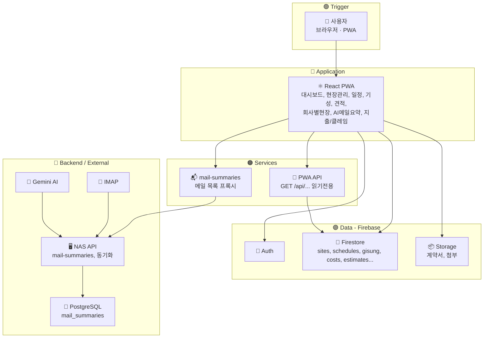

# 천우 건설현장관리시스템 — 워크플로우 다이어그램

n8n/Make 스타일 노드 기반 구조를 **시각적으로** 보려면 브라우저에서 아래 파일을 여세요.

- **`docs/workflow-diagram.html`** — 노드 색상·연결선이 있는 인터랙티브 다이어그램

---

## Mermaid 플로우 (텍스트 버전)

GitHub·Notion·VS Code 등에서 Mermaid를 지원하면 아래 코드로 같은 구조를 볼 수 있습니다.

---

## 노드 요약

| 유형 | 노드 | 설명 |
|------|------|------|
| Trigger | 사용자 | 브라우저에서 chunwoodb.netlify.app 접속 |
| App | React PWA | 현장관리, 일정, 기성, 견적, 회사별현장, AI메일요약 등 |
| API | PWA API | 오늘 일정, 현장 소장/잔액/계약금액/주소/창호/준공일/시공팀 (읽기 전용) |
| API | mail-summaries | 메일 요약 목록 조회 (NAS 프록시) |
| Data | Auth / Firestore / Storage | Firebase 인증·DB·파일 저장소 |
| External | NAS API | 메일 요약 CRUD, 동기화 |
| External | PostgreSQL / IMAP / Gemini | 메일 저장, 수집, AI 요약 |
